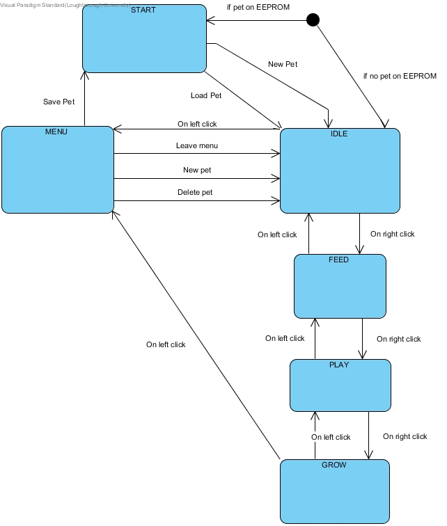

# Virtual-Pet
Virtual pet using an Arduino Uno and an LCD display. The virtual pet has 6 different states (see state diagram below). When the Arduino is turned ON it goes to the start state if there is a saved pet, in this state the user can select to load the existing pet or start a new one. It then goes to IDLE where the user can see all the stats of the pet. It also has 3 states with which the user can interact with the pet, this are: feed, play and grow. There is also a menu where the user can select to save, delete or start a new pet. 

